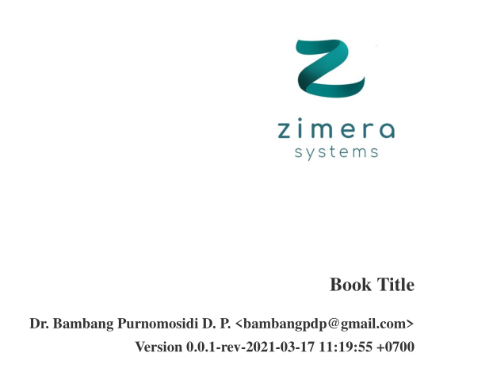
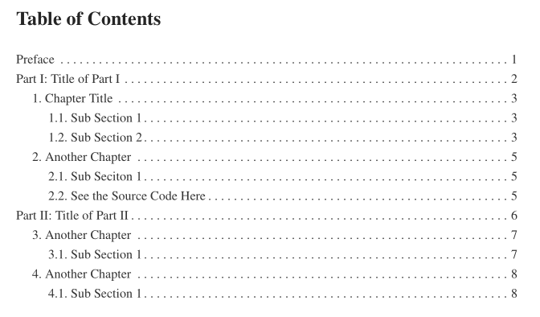
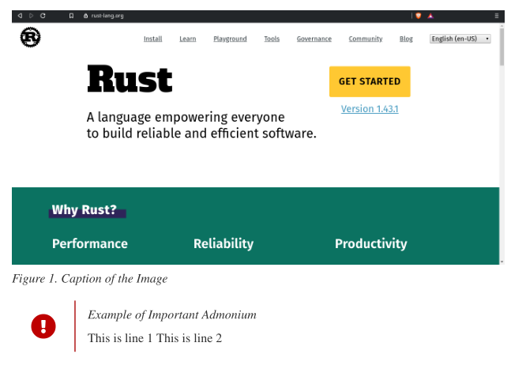
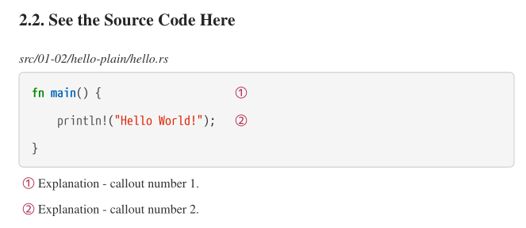

# AsciiDoc(tor) for Technical Documentation

Writing is never an easy task, everybody knows. It is even harder for technical documentation since some pictures, diagrams, and technical drawings are meant to be in the documentation - with some explanatons of course. In software world, those things are also the main problems.

Some of people think, and this is the majority, just use Word Processor software - be it in the desktop or in the cloud. This might work, of course, but might lead to inconsistency. So, we at Zimera Systems has the policy to use open and free tools to power our technical documentation. For this purpose, we find it easier to use Markdown + Pandoc but lately we move to AsciiDoc format and uses Asciidoctor and Asciidoctor-pdf. They are very easy to customize and creating PDF file is a piece of cake with [complete theming guide](https://github.com/asciidoctor/asciidoctor-pdf/blob/master/docs/theming-guide.adoc).

The documentation title can be as simple as logo and the author, but can also takes full image so that we can use the whole picture when we really need to. Here's the simple title without the whole picture:

Table of contents will be organized automatically:

We love the picture and the admonium:

For us who are really passionate in coding, we especially love the callout:

We make our template open and you may get them at [our repository](https://github.com/zimera-systems/book-template-asciidoc).

Enjoy writing!

