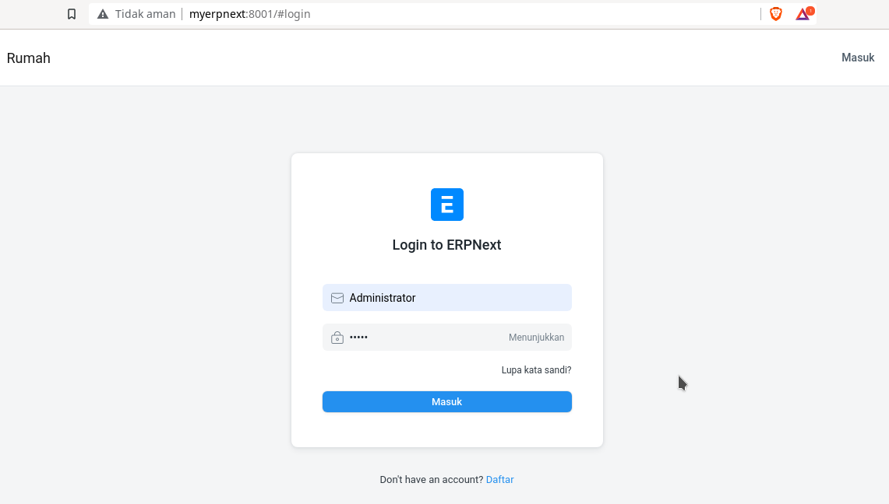
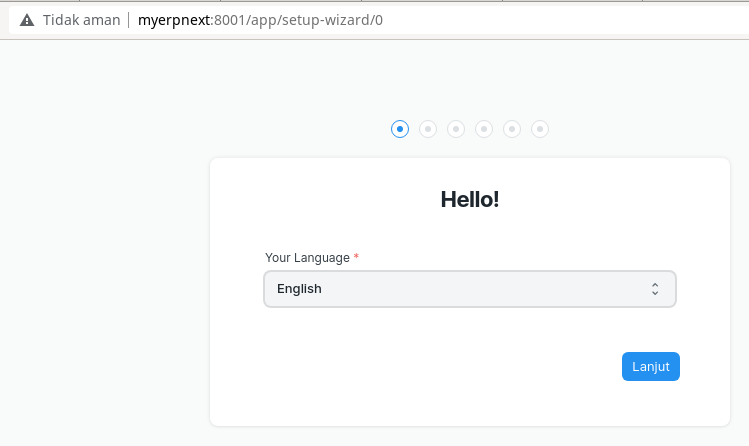
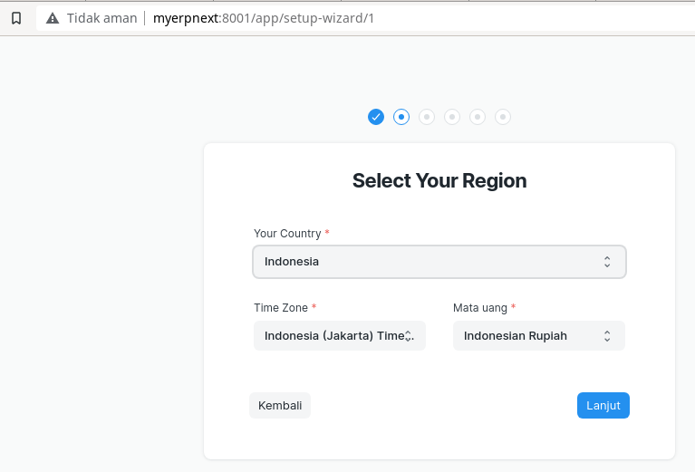
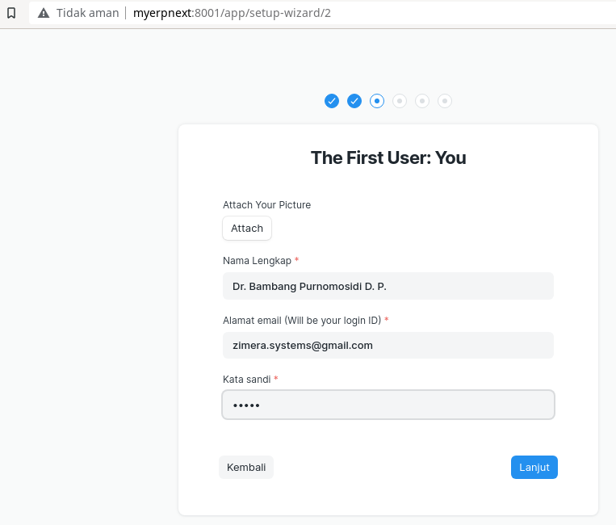
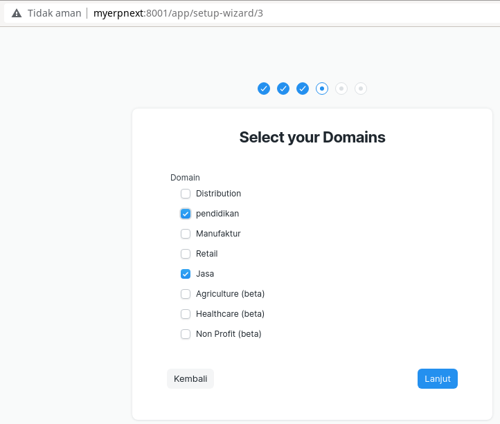
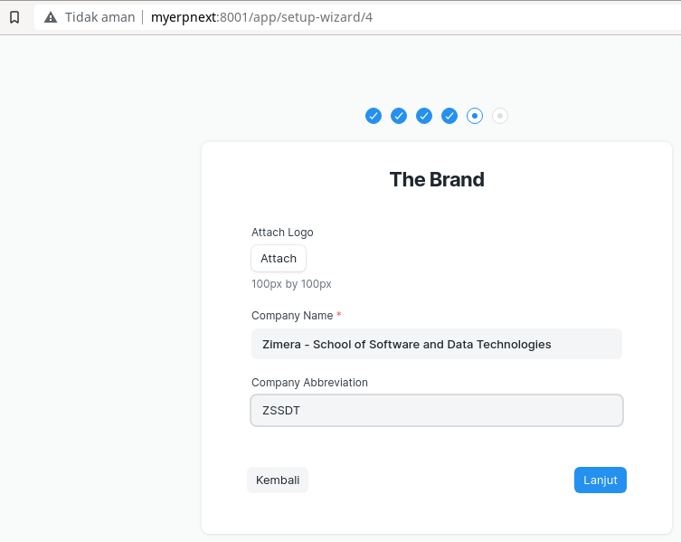
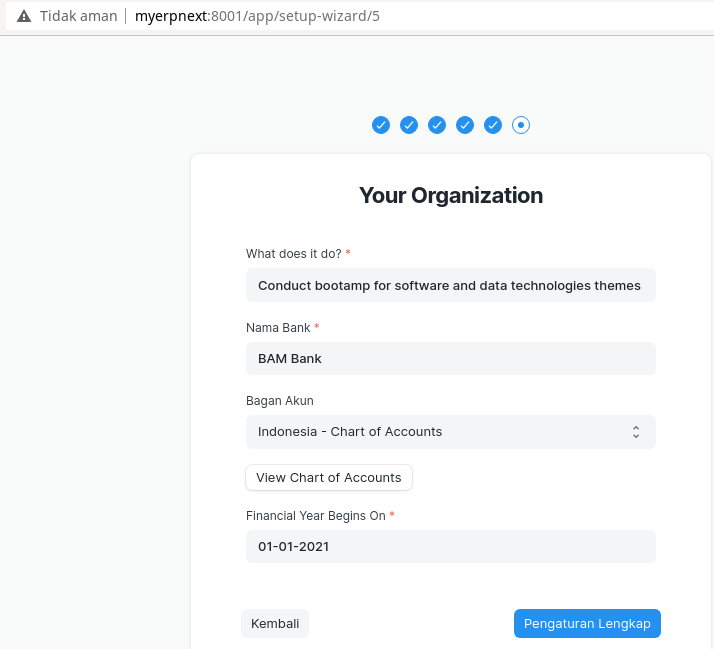
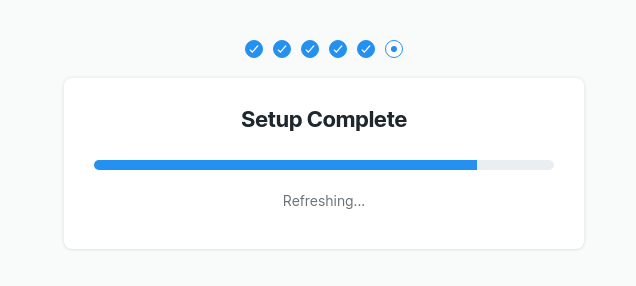

# ERPNext Installation Details

[ERPNext](https://erpnext.com) is one of free / open source ERP software available in today's market. Beside their cloud offering, there is a possibility to use ERPNext on-premmise. However, installation instructions are not quite clear. I personally have to experiment with installation many times before I got ... "oh this is how things work". I hope, this is not because I am too slow. LOL. So here is my details instruction on how to make ERPNext installed properly.

## Preparation

ERPNext is developed in Python using Frappe Framework (will use `Frappe` term in this article). Both ERPNext and Frappe come from the same company with many community supporters. MariaDB is used for the DBMS, so, before going into details, here is our list of software which I prepare before ERPNext installation:

1. [Python](https://www.python.org): the programming language to implement Frappe and ERPNext on top of Frappe.
2. [MariaDB](https://mariadb.org): the DBMS, used to store and manage data. 
3. [Frappe](https://frappe.io/): software framework, based on Python, used to build ERPNext. 
4. [Bench](https://github.com/frappe/bench): a CLI program to manage multi-tenant deployments for Frappe apps. 
5. [Node.js](https://nodejs.org): JavaScript engine, used by Frappe for frontend purposes.
6. [yarn](https://yarnpkg.com/): package manager for Node.js. 
7. [Git](https://git-scm.com): version control system, used by **bench CLI**.  

## Installation and Configuration for Infrastructure Software

### Python

I use [Miniconda](https://docs.conda.io/en/latest/miniconda.html) distribution. See this [installation instructions](https://conda.io/projects/conda/en/latest/user-guide/install/index.html) for information on how to install Miniconda. After installation, create environment - special for this ERPNext installation:

```
$ conda create -n py39-erpnext python=3.9
$ conda activate py39-erpnext
$ python                                                                                 Python 3.9.6 (default, Jul 30 2021, 16:35:19) 
[GCC 7.5.0] :: Anaconda, Inc. on linux
Type "help", "copyright", "credits" or "license" for more information.
>>> 
$
```

All of our steps to install ERPNext will be done in this shell. If you want to open another shell, activate conda environment **py39-erpnext**, just like above commands.

### MariaDB

Get MariaDB at https://mariadb.org/download/, install using installation instructions at https://mariadb.com/kb/en/binary-packages/ and then change its configuration (usually you have to edit **my.cnf**, in most Linux distribution you can find this file in `/etc/mysql/my.cnf`):

```bash
...
collation-server = utf8mb4_unicode_ci
innodb_file_format = Barracuda
...
```
Run MariaDB server process using the instructions at https://mariadb.com/kb/en/starting-and-stopping-mariadb-automatically/. 

User *root* comes with no password, so, I choose to set root password:

```bash
mysqladmin -u root password 'root'
```

**Notes**: I use *root* as password for root just for simplicity.

Test your MariaDB installation:

```bash
$ mysql -u root -p
Enter password: 
Welcome to the MariaDB monitor.  Commands end with ; or \g.
Your MariaDB connection id is 90
Server version: 10.5.12-MariaDB-1 Debian 11

Copyright (c) 2000, 2018, Oracle, MariaDB Corporation Ab and others.

Type 'help;' or '\h' for help. Type '\c' to clear the current input statement.

MariaDB [(none)]> 
$
```

### Frappe

You may read about Frappe at https://github.com/frappe/frappe. In the meantime, this will be installed, together with ERPNext later using `bench`.

### Bench

If you want more information, you can always have a look at its source code here: https://github.com/frappe/bench. Although there are many instructions to install **bench**, the easiest is just:

```bash
$ pip install bench
... 
<some screen dump>
...
$ pip list | grep bench                                                                   
frappe-bench                      5.5.0
$ bench --help                                                                           WARN: Command not being executed in bench directory
Usage:  [OPTIONS] COMMAND [ARGS]...

Options:
  --version
  --help     Show this message and exit.

Commands:
  backup                   Backup single site
  backup-all-sites         Backup all sites in current bench
  clear-command-cache      Clears Frappe Framework cached commands
  config                   Change bench configuration
  disable-production       Disables production environment for the bench.
  download-translations    Download latest translations
  exclude-app              Exclude app from updating
  find                     Finds benches recursively from location
  generate-command-cache   Caches Frappe Framework commands
  get-app                  Clone an app from the internet or filesystem and...
  include-app              Include app for updating
  init                     Initialize a new bench instance in the specified...
  install                  Install system dependencies for setting up
                           Frappe...
  migrate-env              Migrate Virtual Environment to desired Python...
  new-app                  Create a new Frappe application under apps folder
  pip                      For pip help use `bench pip help [COMMAND]` or...
  prepare-beta-release     Prepare major beta release from develop branch
  release                  Release a Frappe app (internal to the Frappe...
  remote-reset-url         Reset app remote url to frappe official
  remote-set-url           Set app remote url
  remote-urls              Show apps remote url
  remove-app               Completely remove app from bench and re-build...
  renew-lets-encrypt       Sets Up latest cron and Renew Lets Encrypt...
  restart                  Restart supervisor processes or systemd units
  retry-upgrade            Retry a failed upgrade
  set-mariadb-host         Set MariaDB host for bench
  set-nginx-port           Set NGINX port for site
  set-redis-cache-host     Set Redis cache host for bench
  set-redis-queue-host     Set Redis queue host for bench
  set-redis-socketio-host  Set Redis socketio host for bench
  set-ssl-certificate      Set SSL certificate path for site
  set-ssl-key              Set SSL certificate private key path for site
  set-url-root             Set URL root for site
  setup                    Setup command group for enabling setting up a...
  src                      Prints bench source folder path, which can be...
  start                    Start Frappe development processes
  switch-to-branch         Switch all apps to specified branch, or specify...
  switch-to-develop        Switch frappe and erpnext to develop branch
  update                   Performs an update operation on current bench.
$
```

### Node.js

See this [installation instructions](https://nodejs.org/en/download/package-manager/). I use version 14.x.x.

### Yarn

After Node.js installation, you should have `node` and `npm`. Install Yarn using this command:

```
$ npm install -g yarn
```

### Git

Usually all Linux distro has Git installed by default. Just in case your Linux box does not have Git or maybe you use MacOS or Windows, see [installation instructions for Git](https://git-scm.com/book/en/v2/Getting-Started-Installing-Git).

## Initialize `bench` Directory

Our applications will reside in one **bench directory**, therefore we need to initialize it first:

```bash
$ bench init --frappe-branch version-13 myERPNext
```

Here's the screen dump:

```bash
$ bench init --frappe-branch version-13 myERPNext
$ /home/bpdp/software/python-dev-tools/miniconda39/envs/py39-erpnext/bin/virtualenv -q env -p python3

Getting frappe
$ git clone https://github.com/frappe/frappe.git --branch version-13 --depth 1 --origin upstream
Kloning ke 'frappe'...
remote: Enumerating objects: 2914, done.
remote: Counting objects: 100% (2914/2914), done.
remote: Compressing objects: 100% (2746/2746), done.
remote: Total 2914 (delta 404), reused 1006 (delta 96), pack-reused 0
Menerima objek: 100% (2914/2914), 16.04 MiB | 1.16 MiB/s, done.
Menguraikan delta: 100% (404/404), done.

Installing frappe
$ myERPNext/env/bin/python -m pip install -q -U -e myERPNext/apps/frappe 
WARNING: You are using pip version 21.2.2; however, version 21.2.3 is available.
You should consider upgrading via the '/home/bpdp/kerjaan/erpnext/myERPNext/env/bin/python -m pip install --upgrade pip' command.
$ yarn install
yarn install v1.22.11
warning ../../../../../../package.json: No license field
[1/4] Resolving packages...
[2/4] Fetching packages...
[3/4] Linking dependencies...
warning " > bootstrap@4.5.0" has unmet peer dependency "jquery@1.9.1 - 3".
warning " > bootstrap@4.5.0" has unmet peer dependency "popper.js@^1.16.0".
warning Workspaces can only be enabled in private projects.
[4/4] Building fresh packages...
$ yarn run snyk-protect
yarn run v1.22.11
warning ../../../../../../package.json: No license field
$ snyk protect
Successfully applied Snyk patches

Done in 11.34s.
Done in 239.98s.
Updating node packages...

Installing node dependencies for frappe
$ yarn install
yarn install v1.22.11
warning ../../../../../../package.json: No license field
[1/4] Resolving packages...
success Already up-to-date.
$ yarn run snyk-protect
yarn run v1.22.11
warning ../../../../../../package.json: No license field
$ snyk protect
Successfully applied Snyk patches

Done in 9.18s.
Done in 9.87s.
$ bench build
An Error occurred while downloading assets...
✔ Application Assets Linked                                                                                                 

yarn run v1.22.11
warning ../../../../../../package.json: No license field
$ FRAPPE_ENV=production node rollup/build.js
Production mode
✔ Built js/moment-bundle.min.js
✔ Built js/libs.min.js

Building frappe assets...

✔ Built js/checkout.min.js
✔ Built js/dialog.min.js
✔ Built js/web_form.min.js
✔ Built js/user_profile_controller.min.js
✔ Built js/list.min.js
✔ Built js/chat.js
✔ Built js/bootstrap-4-web.min.js
✔ Built js/frappe-recorder.min.js
✔ Built js/barcode_scanner.min.js
✔ Built js/frappe-web.min.js
✔ Built css/report.min.css
✔ Built css-rtl/report.min.css
✔ Built css/frappe-chat-web.css
✔ Built css/web_form.css
✔ Built css-rtl/frappe-chat-web.css
✔ Built css-rtl/web_form.css
✔ Built js/data_import_tools.min.js
✔ Built js/report.min.js
✔ Built css/printview.css
✔ Built css/email.css
✔ Built css/login.css
✔ Built css/frappe-web-b4.css
✔ Built js/desk.min.js
✔ Built js/control.min.js
✔ Built css/desk.min.css
✔ Built css-rtl/frappe-web-b4.css
✔ Built css-rtl/email.css
✔ Built css-rtl/login.css
✔ Built css-rtl/printview.css
✔ Built css-rtl/desk.min.css
✔ Built js/form.min.js
✨  Done in 47.395s
Done in 48.40s.
SUCCESS: Bench myERPNext initialized
$
```

At this point, we already have one bench directory, named myERPNext.

> **NOTE**: The term **bench/Bench** usually denotes two things: **directory** and **CLI**. Starting now, we will call **bench/Bench directory** as **bench/Bench** and **bench/Bench CLI** as **bench/Bench CLI**.

In this bench, we will create our site and then get the app (ERPNext) and install our ERPNext app into our site.

## Create New Site

Set the host first:

```bash
$ cat /etc/hosts
127.0.0.1	localhost
127.0.1.1	dellvuan	dellvuan
127.0.1.1	myerpnext	myerpnext

# The following lines are desirable for IPv6 capable hosts
::1     localhost ip6-localhost ip6-loopback
ff02::1 ip6-allnodes
ff02::2 ip6-allrouters
$ ping myerpnext
PING myerpnext (127.0.1.1) 56(84) bytes of data.
64 bytes from dellvuan (127.0.1.1): icmp_seq=1 ttl=64 time=0.052 ms
64 bytes from dellvuan (127.0.1.1): icmp_seq=2 ttl=64 time=0.031 ms
^C
--- myerpnext ping statistics ---
2 packets transmitted, 2 received, 0% packet loss, time 1021ms
rtt min/avg/max/mdev = 0.031/0.041/0.052/0.010 ms
$
```

Use this command to create a new site (**myerpnext**):

```bash
$ bench new-site --db-name myerpnextdb myerpnext
MySQL root password: 

Installing frappe...
Updating DocTypes for frappe        : [========================================] 100%
Updating country info               : [========================================] 100%
Set Administrator password: 
Re-enter Administrator password: 
*** Scheduler is disabled ***
$
```
If we do not use `--db-name` then **bench CLI** will use randomly generated name. We need to answer Administrator password. Take note of the password, we're gonna need this later.

## Get ERPNext Application

Use this command:

```bash
$ bench get-app --branch version-13 erpnext
```

Here's the screendump:

```bash
$ bench get-app --branch version-13 erpnext                              

Getting erpnext
$ git clone https://github.com/frappe/erpnext --branch version-13 --depth 1 --origin upstream
Kloning ke 'erpnext'...
remote: Enumerating objects: 7214, done.
remote: Counting objects: 100% (7214/7214), done.
remote: Compressing objects: 100% (5935/5935), done.
remote: Total 7214 (delta 2009), reused 3218 (delta 999), pack-reused 0
Menerima objek: 100% (7214/7214), 18.22 MiB | 650.00 KiB/s, done.
Menguraikan delta: 100% (2009/2009), done.
Updating files: 100% (6777/6777), done.

Installing erpnext
$ ./env/bin/python -m pip install -q -U -e ./apps/erpnext 
WARNING: You are using pip version 21.2.2; however, version 21.2.3 is available.
You should consider upgrading via the '/home/bpdp/kerjaan/erpnext/myERPNext/env/bin/python -m pip install --upgrade pip' command.
$ yarn install
yarn install v1.22.11
warning ../../../../../../package.json: No license field
[1/4] Resolving packages...
[2/4] Fetching packages...
[3/4] Linking dependencies...
warning Workspaces can only be enabled in private projects.
[4/4] Building fresh packages...
$ yarn run snyk-protect
yarn run v1.22.11
warning ../../../../../../package.json: No license field
$ snyk protect
Successfully applied Snyk patches

Done in 3.90s.
Done in 89.54s.
$ bench build --app erpnext
✔ Application Assets Linked                                                                                                 

yarn run v1.22.11
warning ../../../../../../package.json: No license field
$ FRAPPE_ENV=production node rollup/build.js --app erpnext
Production mode
✔ Built js/moment-bundle.min.js
✔ Built js/libs.min.js

Building erpnext assets...

✔ Built js/erpnext-web.min.js
✔ Built js/bank-reconciliation-tool.min.js
✔ Built js/item-dashboard.min.js
✔ Built js/point-of-sale.min.js
✔ Built js/erpnext.min.js
✔ Built css/erpnext-web.css
✔ Built css/erpnext.css
✔ Built css/marketplace.css
✔ Built css-rtl/erpnext-web.css
✔ Built css-rtl/marketplace.css
✔ Built css-rtl/erpnext.css
✔ Built js/marketplace.min.js
✨  Done in 9.535s
Done in 10.40s.
$
```

## Install ERPNext Into the Site

Once we get ERPNext, we can install it into our site:

```bash
$ bench --site myerpnext install-app erpnext                             (py39-erpnext) 

Installing erpnext...
Updating DocTypes for erpnext       : [========================================] 100%
Updating customizations for Address
Updating customizations for Contact
$
```

## Setup Frappe for Production Environment

We cah use **bench CLI** to setup Frappe for production environment, especially for specific user. Here, my username is **bpdp**, so we will do setup for user **bpdp**. To setup production environment using **bench CLI**, we need to use **sudo** since the command will change some system settings. Using `sudo` for `miniconda` distribution is a little bit tricky since `sudo` usually can not find command from `miniconda` because `miniconda` is installed for user. Therefore we need to use full path:

```bash
$ sudo /home/bpdp/software/python-dev-tools/miniconda39/envs/py39-erpnext/bin/bench setup production bpdp
```

At this point, our installation has fisnished successfully. Next, we will run our ERPNext app and doing some initial setup.

## Run ERPNext

To run ERPNext, use **bench CLI** below;

```bash
$ bench start
...
...
<screendump>
...
...
16:31:26 web.1            |  * Running on http://0.0.0.0:8001/ (Press CTRL+C to quit)
...
...
16:31:56 watch.1          | Rebuilding bank-reconciliation-tool.min.js
16:31:56 watch.1          | Rebuilding erpnext.css
16:31:56 watch.1          | Rebuilding marketplace.css
16:31:56 watch.1          | Rebuilding erpnext-web.css
$
```

> **NOTE**: The screendump above display the port which is accessible using browser where ERPNext serves.

## Initial Setup

Using browser, access http://myerpnext:8001/, a login screen appear:



Use the password which has been created above and Administrator user.



Choose your language.



Choose region and fill timezone and currency.



Create user. You may put picture or not.



Choose domain / industry where our company operate. We may choose more than one for later process.



Brand of our company. Logo for our company also optional.



More info about our company can be filled now. 



Wait until setup finish successfully.


Setup completed! Right now, we can start use our ERPNext. Enjoy!
