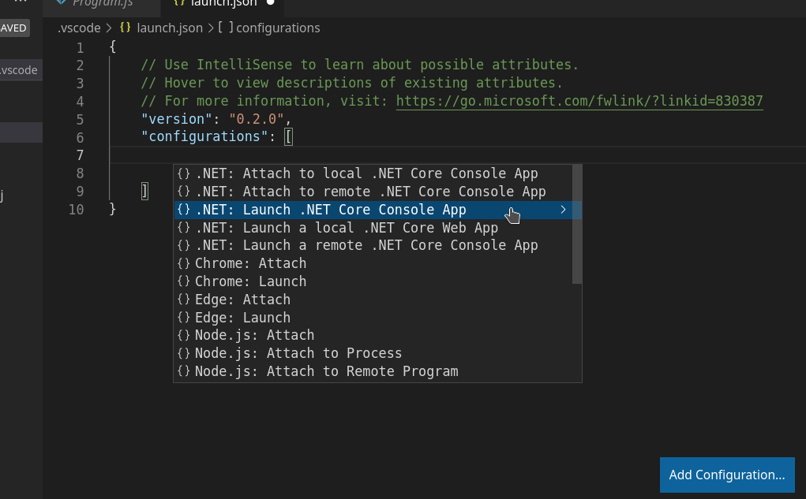
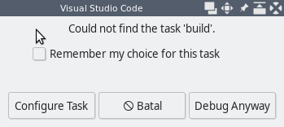
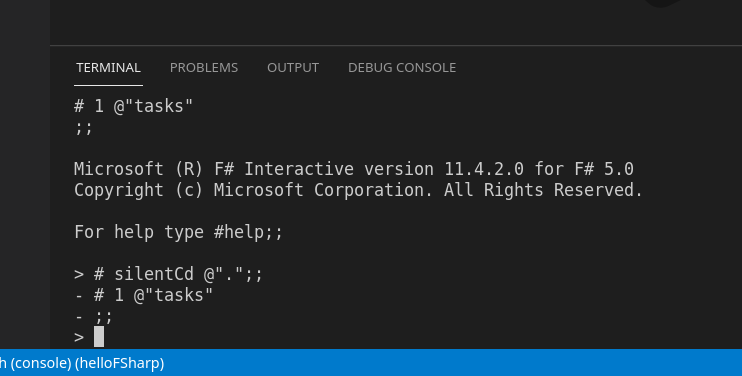

# Getting Started with F# and VSCode in Linux

F# has become one of the primary programming language on the .NET environment. F# is developed by a non-profit organization: [The F# Software Foundation](https://foundation.fsharp.org/). Don Syme serves as lead designer of F# together with Microsoft Research. Installing .NET SDK means you have F# SDK at your disposal. Here, I will describe how I use Visual Studio Code for F# development. It is intended for beginners who are confused when they first use VSCode with F# (just like me, some time ago).

## Install .NET SDK

To install .NET SDK, download the SDK from [.NET SDK Download](https://dotnet.microsoft.com/download/dotnet). Download current release and extract them:

```bash
$ mkdir ~/sofware/dotnet-5
$ cd ~/software/dotnet-5
$ tar -xvf ~/Downloads/dotnet-sdk-5.0.400-linux-x64.tar.gz
$ ls -la
total 224
drwxr-xr-x 7 bpdp bpdp   4096 Jul 27 01:49 ./
drwxr-xr-x 6 bpdp bpdp   4096 Agu 13 11:27 ../
-rwxr-xr-x 1 bpdp bpdp 133632 Jul 10 01:26 dotnet*
drwxr-xr-x 3 bpdp bpdp   4096 Jul 10 01:28 host/
-rw-r--r-- 1 bpdp bpdp   1116 Jul 10 01:22 LICENSE.txt
drwxr-xr-x 6 bpdp bpdp   4096 Jul 27 01:49 packs/
drwxr-xr-x 3 bpdp bpdp   4096 Jul 27 01:49 sdk/
drwxr-xr-x 4 bpdp bpdp   4096 Jul 16 00:50 shared/
drwxr-xr-x 3 bpdp bpdp   4096 Jul 27 01:49 templates/
-rw-r--r-- 1 bpdp bpdp  60108 Jul 10 01:22 ThirdPartyNotices.txt
$
```

Now, .NET SDK is installed at `~/software/dotnet-5` directory. We need to tell shell that the new PATH to include the directory location of .NET SDK. I usually put this command inside a file (whatever filename and location, up to you - example here: `$HOME/env/dotnet.sh`):

**Bash**

```
export PATH=$HOME/software/dotnet-5:$PATH
```

**Fish**

```bash
set -x DOTNET_ROOT $HOME/software/dotnet-5
set PATH $DOTNET_ROOT $PATH
```

Whenever needed, we can `source` the file (just once in every shell/terminal):

```bash
source ~/env/dotnet.sh
```

Test that .NET SDK has been installed successfully:

```bash
$ dotnet --info
.NET SDK (reflecting any global.json):
 Version:   5.0.400
 Commit:    d61950f9bf

Runtime Environment:
 OS Name:     devuan
 OS Version:  4
 OS Platform: Linux
 RID:         linux-x64
 Base Path:   /home/bpdp/software/dotnet-5/sdk/5.0.400/

Host (useful for support):
  Version: 5.0.9
  Commit:  208e377a53

.NET SDKs installed:
  5.0.400 [/home/bpdp/software/dotnet-5/sdk]

.NET runtimes installed:
  Microsoft.AspNetCore.App 5.0.9 [/home/bpdp/software/dotnet-5/shared/Microsoft.AspNetCore.App]
  Microsoft.NETCore.App 5.0.9 [/home/bpdp/software/dotnet-5/shared/Microsoft.NETCore.App]

To install additional .NET runtimes or SDKs:
  https://aka.ms/dotnet-download
$
```

We can check wheter we can use F# or not by executing REPL for F# (`fsi`):

```bash
$ dotnet fsi

Microsoft (R) F# Interactive version 11.4.2.0 for F# 5.0
Copyright (c) Microsoft Corporation. All Rights Reserved.

For help type #help;;

>
```

It all things work, congratulation, you have .NET SDK and F# on your Linux machine. Next, we use VSCode and Ionide for our F# development.

## VSCode and Ionide

[Visual Studio Code - VSCode](https://code.visualstudio.com/) is a code editing tools. It provides text editor capabilities and extensible. Many vendor and communities provide extensions for many programming languages. They are all exist at [VSCode Marketplace](https://marketplace.visualstudio.com/vscode).

[Download VSCode](https://code.visualstudio.com/Download) and then extract the tarball to a directory:

```bash
$ tar -xvf ~/Downloads/code-stable-x64-1628120346.tar.gz
$ mv ~/VSCode-linux-x64 ~/software/
```

Edit $HOME/env/dotnet.sh which we've already created before (see above). Add this line:

**Bash**

```bash
export PATH=$HOME/software/VSCode-linux-x64/bin:$PATH
```

**Fish**

```bash
set -x PATH $HOME/software/VSCode-linux-x64/bin $PATH
```

Close the terminal / shell so that you can source the file later.

Now, install [Ionide] extension for VSCode which will turn VSCode into a fullblown F# IDE. Source the file (open new shell / terminal first):

```bash
$ source ~/env/dotnet.sh
```

Run VScode from shell/terminal using:

```bash
$ code
```

Follow installation instructions at [Ionide-fsharp extension](https://marketplace.visualstudio.com/items?itemName=Ionide.Ionide-fsharp). This will also install C# extension since C# extension is Ionide's pre-requisites.

Close VSCode for now.

## F# Project at VSCode - Ionide

We can use `dotnet` command to create a project skeleton, based on a template. Here's some templates:

```bash
$ dotnet new --list
Template Name                                 Short Name      Language    Tags
--------------------------------------------  --------------  ----------  ----------------------
Console Application                           console         [C#],F#,VB  Common/Console
Class library                                 classlib        [C#],F#,VB  Common/Library
Worker Service                                worker          [C#],F#     Common/Worker/Web
MSTest Test Project                           mstest          [C#],F#,VB  Test/MSTest
NUnit 3 Test Item                             nunit-test      [C#],F#,VB  Test/NUnit
NUnit 3 Test Project                          nunit           [C#],F#,VB  Test/NUnit
xUnit Test Project                            xunit           [C#],F#,VB  Test/xUnit
Razor Component                               razorcomponent  [C#]        Web/ASP.NET
Razor Page                                    page            [C#]        Web/ASP.NET
MVC ViewImports                               viewimports     [C#]        Web/ASP.NET
MVC ViewStart                                 viewstart       [C#]        Web/ASP.NET
Blazor Server App                             blazorserver    [C#]        Web/Blazor
Blazor WebAssembly App                        blazorwasm      [C#]        Web/Blazor/WebAssembly
ASP.NET Core Empty                            web             [C#],F#     Web/Empty
ASP.NET Core Web App (Model-View-Controller)  mvc             [C#],F#     Web/MVC
ASP.NET Core Web App                          webapp          [C#]        Web/MVC/Razor Pages
ASP.NET Core with Angular                     angular         [C#]        Web/MVC/SPA
ASP.NET Core with React.js                    react           [C#]        Web/MVC/SPA
ASP.NET Core with React.js and Redux          reactredux      [C#]        Web/MVC/SPA
Razor Class Library                           razorclasslib   [C#]        Web/Razor/Library
ASP.NET Core Web API                          webapi          [C#],F#     Web/WebAPI
ASP.NET Core gRPC Service                     grpc            [C#]        Web/gRPC
dotnet gitignore file                         gitignore                   Config
global.json file                              globaljson                  Config
NuGet Config                                  nugetconfig                 Config
Dotnet local tool manifest file               tool-manifest               Config
Web Config                                    webconfig                   Config
Solution File                                 sln                         Solution
Protocol Buffer File                          proto                       Web/gRPC
$
```
To create a project using a template inside an empty directory:

```bash
$ dotnet new console -lang f#
```

Here's the screendump:

```bash
$ mkdir helloFSharp
$ cd helloFSharp/
$ dotnet new console -lang f#
The template "Console Application" was created successfully.

Processing post-creation actions...
Running 'dotnet restore' on /home/bpdp/kerjaan/src/fsharp/helloFSharp/helloFSharp.fsproj...
  Determining projects to restore...
  Restored /home/bpdp/kerjaan/src/fsharp/helloFSharp/helloFSharp.fsproj (in 440 ms).
Restore succeeded.

$ ls -la
total 20
drwxr-xr-x  3 bpdp bpdp 4096 Agu 13 21:07 ./
drwxr-xr-x 17 bpdp bpdp 4096 Agu 13 21:07 ../
-rw-r--r--  1 bpdp bpdp  282 Agu 13 21:07 helloFSharp.fsproj
drwxr-xr-x  2 bpdp bpdp 4096 Agu 13 21:07 obj/
-rw-r--r--  1 bpdp bpdp  342 Agu 13 21:07 Program.fs
$
```

From this point, we can run our project using `dotnet run`:

```bash
$ dotnet run
Hello world from F#
$
```

Are we finish? yes, if we do not use VSCode. Since we will use VSCode for out FSharp IDE, from that directory, do this (of course we have `source ~/env/dotnet.sh` in this shell / terminal before):

```bash
$ code .
```

> **Attention**: there is dot after `code`.

Inside VSCode, click on `Program.fs` so that this file is opened. Run program using `F5` key. VSCode will ask for *environment*. Choose `.NET Core`:


VSCode will ask some options to launch the compilation process and run the result. `launch.json` is opened since we do not have that file. The bottom-right of VSCode shows `Add Configuration` button. Click on that button and choose this:



Change the `program` from:

```bash
"program": "${workspaceFolder}/bin/Debug/<target-framework>/<project-name.dll>",
```

to this:

```bash
"program": "${workspaceFolder}/bin/Debug/dotnet-5/helloFSharp.dll",
```

> **Note**: see `helloFSharp.fsproj` file to fill `target-framework`.

Save the file, and then hit `F5` key again. VSCode will display a dialog, shows that we haven't define *buld* task since we don't have `tasks.json` file.



Choose `Configure task` then `Create tasks.json file from template`, choose `.NET Core`. VSCode will open `tasks.json` file. Save file then hit `F5`. The result can be seen in `DEBUG CONSOLE`:


Now, we can start out development process. Any new project should have `launch.json` and `tasks.json`. They are all saved inside `.vscode/` directory:

```bash
$ ls -la .vscode/
total 16
drwxr-xr-x 2 bpdp bpdp 4096 Agu 13 21:56 ./
drwxr-xr-x 5 bpdp bpdp 4096 Agu 13 21:30 ../
-rw-r--r-- 1 bpdp bpdp  649 Agu 13 21:51 launch.json
-rw-r--r-- 1 bpdp bpdp  770 Agu 13 21:56 tasks.json
$
```

There are many possibilities but the most important thing is now we know at least 2 json files and how to create them. Later on, we will modify them, depend on our project requirements.

## F# REPL

Ionide also provides `FSI:Start` from *Command pallette* (`Ctrl-Shift-P`) to execute REPL (*Read-Eval-Print-Loop*):



That's all. Now you may start your F# development, using whatever templates you like and then change `launch.json` and `tasks.json` properly.
