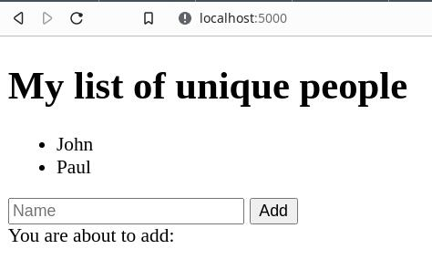

So I am stuck again when I want to create a web app. Don't laugh. I come from *NIX environment and the way everything is started in WebSharper is quite confusing at first. I tried to go to [installation documentation](https://developers.websharper.com/docs/v4.x/fs/overview) but I don't use Visual Studio nor MonoDevelop. Using [paket](https://fsprojects.github.io/Paket/) also doesn't solve my problem since they also seem to use Visual Studio or MonoDevelop. 

As someone who used to work in a shell environment, of course using shell is always my preferred way to do something. Then I open the [Downloads page](https://websharper.com/downloads) which turns out become my saviour.

In short, I have to install template first then using the template to create a skeleton of application and then hack away that skeleton. Easier for me :-D. 

> **Note**: make sure you have installed .NET SDK - current version 5.x.x and .NET SDK - LTS version 3.x.x. Read my other [article](https://dev.to/zimera/multiple-net-sdk-and-runtimes-installation-28bi) on this matter. 

## Install Application Template

```bash
$ dotnet new -i WebSharper.Templates
Template Name                                 Short Name       Language    Tags                  
--------------------------------------------  ---------------  ----------  ----------------------
Console Application                           console          [C#],F#,VB  Common/Console        
Class library                                 classlib         [C#],F#,VB  Common/Library        
Worker Service                                worker           [C#],F#     Common/Worker/Web     
MSTest Test Project                           mstest           [C#],F#,VB  Test/MSTest           
NUnit 3 Test Item                             nunit-test       [C#],F#,VB  Test/NUnit            
NUnit 3 Test Project                          nunit            [C#],F#,VB  Test/NUnit            
xUnit Test Project                            xunit            [C#],F#,VB  Test/xUnit            
Razor Component                               razorcomponent   [C#]        Web/ASP.NET           
Razor Page                                    page             [C#]        Web/ASP.NET           
MVC ViewImports                               viewimports      [C#]        Web/ASP.NET           
MVC ViewStart                                 viewstart        [C#]        Web/ASP.NET           
Blazor Server App                             blazorserver     [C#]        Web/Blazor            
Bolero Hosted Application                     bolero-app       F#          Web/Blazor/Bolero     
Blazor WebAssembly App                        blazorwasm       [C#]        Web/Blazor/WebAssembly
ASP.NET Core Empty                            web              [C#],F#     Web/Empty             
ASP.NET Core Web App (Model-View-Controller)  mvc              [C#],F#     Web/MVC               
ASP.NET Core Web App                          webapp           [C#]        Web/MVC/Razor Pages   
ASP.NET Core with Angular                     angular          [C#]        Web/MVC/SPA           
ASP.NET Core with React.js                    react            [C#]        Web/MVC/SPA           
ASP.NET Core with React.js and Redux          reactredux       [C#]        Web/MVC/SPA           
Razor Class Library                           razorclasslib    [C#]        Web/Razor/Library     
ASP.NET Core Web API                          webapi           [C#],F#     Web/WebAPI            
ASP.NET Core gRPC Service                     grpc             [C#]        Web/gRPC              
WebSharper 4 Extension                        websharper-ext   F#          WebSharper            
WebSharper 4 Library                          websharper-lib   [C#],F#     WebSharper            
WebSharper 4 Proxy                            websharper-prx   [C#],F#     WebSharper            
WebSharper 4 Client-Server Application        websharper-web   [C#],F#     WebSharper/Web        
WebSharper 4 Html Site                        websharper-html  [C#],F#     WebSharper/Web        
WebSharper 4 Single Page Application          websharper-spa   [C#],F#     WebSharper/Web        
dotnet gitignore file                         gitignore                    Config                
global.json file                              globaljson                   Config                
NuGet Config                                  nugetconfig                  Config                
Dotnet local tool manifest file               tool-manifest                Config                
Web Config                                    webconfig                    Config                
Solution File                                 sln                          Solution              
Protocol Buffer File                          proto                        Web/gRPC              

Examples:
    dotnet new mvc --auth Individual
    dotnet new websharper-lib
    dotnet new --help
    dotnet new websharper-web --help
$
```

Now we have these templates:

```bash
...
...
WebSharper 4 Extension                        websharper-ext   F#          WebSharper            
WebSharper 4 Library                          websharper-lib   [C#],F#     WebSharper            
WebSharper 4 Proxy                            websharper-prx   [C#],F#     WebSharper            
WebSharper 4 Client-Server Application        websharper-web   [C#],F#     WebSharper/Web        
WebSharper 4 Html Site                        websharper-html  [C#],F#     WebSharper/Web        
WebSharper 4 Single Page Application          websharper-spa   [C#],F#     WebSharper/Web        
...
...
```

Pay attention to the **shortname**, we are going to use that. To see more information about the templates:

```bash
...
...
...
  WebSharper.Templates
    Details:
      NuGetPackageId: WebSharper.Templates
      Version: 4.7.3.424
      Author: IntelliFactory
    Templates:
      WebSharper 4 Client-Server Application (websharper-web) C#
      WebSharper 4 Client-Server Application (websharper-web) F#
      WebSharper 4 Extension (websharper-ext) F#
      WebSharper 4 Library (websharper-lib) C#
      WebSharper 4 Library (websharper-lib) F#
      WebSharper 4 Html Site (websharper-html) C#
      WebSharper 4 Html Site (websharper-html) F#
      WebSharper 4 Proxy (websharper-prx) C#
      WebSharper 4 Proxy (websharper-prx) F#
      WebSharper 4 Single Page Application (websharper-spa) C#
      WebSharper 4 Single Page Application (websharper-spa) F#
    Uninstall Command:
      dotnet new -u WebSharper.Templates
$
```

There are 6 types of templates:

1. **Client-Server Application** / `websharper-web`: full client-server application - in other world, it is usually called **fullstack**.
2. **Extension** / `websharper-ext`: interface to an existing JS library.
3. **Library** / `websharper-lib`: library which can be used in any WebSharper project.
4. **HTML Site** / `websharper-html`: multipage HTML/JavaScript application.
5. **Proxy** / `websharper-prx`: JavaScript-compilable F# implementations for classes and modules that were compiled without WebSharper.
6. **Single Page Application** / `websharper-spa`: single page HTML/JavaScript with HTML and F# contents plugs into it.

As an example, I will use SPA template to create a skeleton of SPA project. Here's how to do that:

```bash
$ dotnet new websharper-spa -lang f# -n helloSPA
The template "WebSharper 4 Single Page Application" was created successfully.
...
...
```

> **Note**: `helloSPA` is project name which later becomes application name.

Here's the results:

```bash
$ cd helloSPA
$ ls -la
total 28
drwxr-xr-x 3 bpdp bpdp 4096 Agu 25 10:19 ./
drwxr-xr-x 3 bpdp bpdp 4096 Agu 25 10:19 ../
-rw-r--r-- 1 bpdp bpdp 1019 Agu 25 10:19 Client.fs
-rw-r--r-- 1 bpdp bpdp  599 Agu 25 10:19 helloSPA.fsproj
-rw-r--r-- 1 bpdp bpdp 1045 Agu 25 10:19 Startup.fs
-rw-r--r-- 1 bpdp bpdp  123 Agu 25 10:19 wsconfig.json
drwxr-xr-x 2 bpdp bpdp 4096 Agu 25 10:19 wwwroot/
$
```

That's it. Now we have a skeleton of SPA app. Let's try to run it.

```bash
$ dotnet run
Hosting environment: Production
Content root path: /home/bpdp/kerjaan/src/fsharp/websharper/artikel/helloSPA
Now listening on: http://localhost:5000
Now listening on: https://localhost:5001
Application started. Press Ctrl+C to shut down.
```

Open `http://localhost:5000` using your browser:



Voila! you have WebSharper up and running. Now, what you need to do is to understand the contents of an SPA app using WebSharper. This one deserves its own articles. At this point, your knowledge on F#, packages / libs, and WebSharper is important. 

## Update Templates

Whenever there are new releases, we can always update the templates using:

```bash
$ dotnet new -i "WebSharper.Templates::*"
```

Happy coding!

